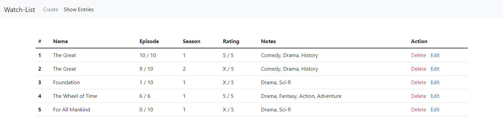

# Angular CRUD

A CRUD application built with Angular and Firebase

## Installation

Clone this repository

```bash
git clone https://github.com/howtoduck/angular-crud
```

Install firebase package

```bash
npm install firebase @angular/fire
```

## Usage

Update the **environment.ts** and **environment.prod.ts** with your firebase data

```bash
export const environment = {
  production: true,
  firebaseConfig: {
    apiKey: 'xxxxxxxxxxxxxxxxxxxxxxxxxxxxxxxxxx',
    authDomain: 'xxxxxxxxxxxxxxxxxxxxxxxxxxxxxxxxxx',
    projectId: 'xxxxxxxxxxxxxxxxxxxxxxxxxxxxxxxxxx',
    storageBucket: 'xxxxxxxxxxxxxxxxxxxxxxxxxxxxxxxxxx',
    messagingSenderId: 'xxxxxxxxxxxxxx',
    appId: 'x:xxxxxxxxxxxxxxxxxxxxxxxxxxxxxxxxxx',
  },
};
```

### Data


I used this angular app to store data for television shows, if you want to change what data is being stored and presented you can edit **create-entry.component.html, edit-entry.component.html,** and **list-entry.component.html**.


## License
[MIT](https://choosealicense.com/licenses/mit/)